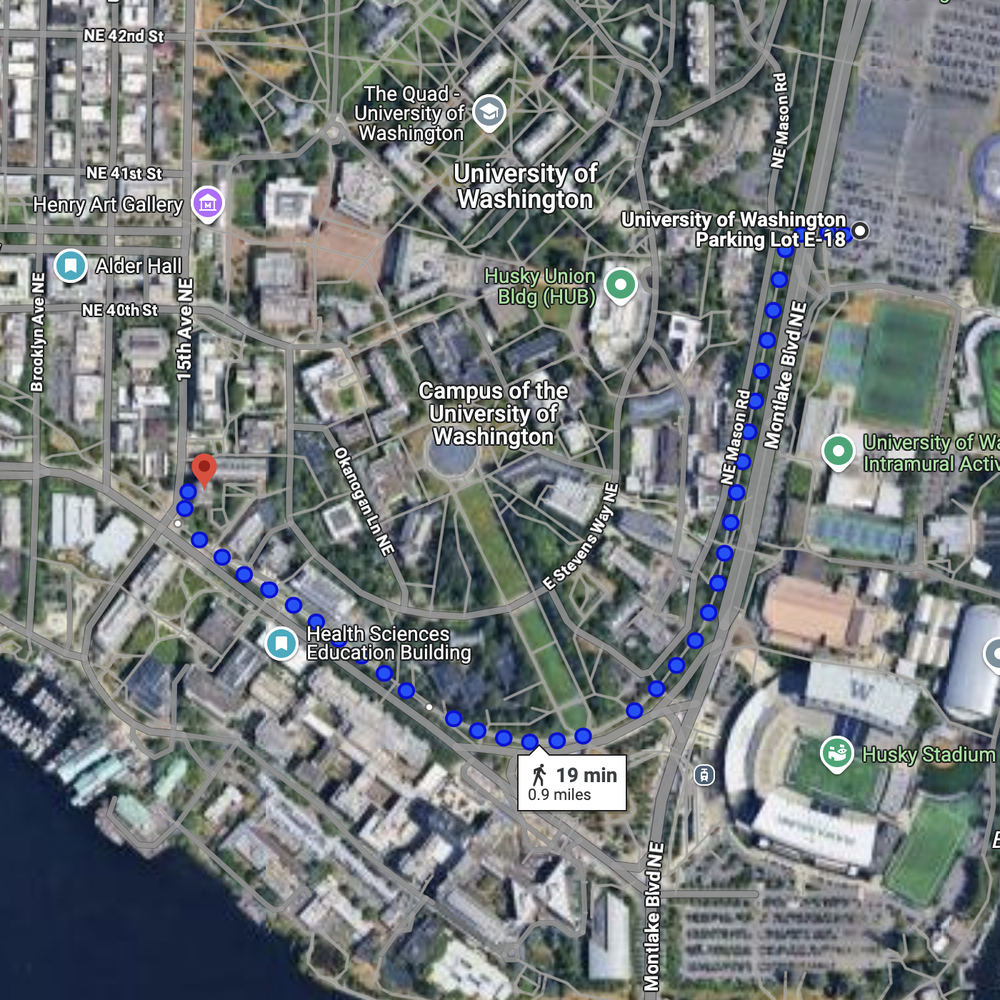

# Travel & Accommodation

## Travel Support
```{Note}
Accommodation is a fluid situation that will be finalized closer to the event. 
For your planning purposes, here is what we know as of mid-April 2025:
1. Funds are available to support participant travel and lodging. Details on funding availability will be provided as we invite participants to the event.
2. We are still determining if we will use campus dorms or campus adjacent hotels. 
This will be largely driven by total attendance size.
3. Updated information will be posted here listing arrival instructions and other 
specifics as the details are finalized. If in doubt or if you have any questions, reach 
out to [Mark Welden-Smith](mailto:escience-hackweks@uw.edu) on email or DM via 
[ICESAT-2 Slack](https://icesat2hackweek.slack.com/).
```

### Self-Accommodation Suggestions

```{Note} 
If booking your own accommodation we recommend the following venues:

**[The University Inn](https://www.staypineapple.com/university-inn-seattle-wa)**
4140 Roosevelt Way NE Seattle, WA 98105
(206) 632-5055

**[The Watertown Hotel](https://www.staypineapple.com/watertown-hotel-seattle-wa)**
4242 Roosevelt Way NE Seattle, WA 98105
(206) 826-4242

**[Residence Inn - University District](https://www.marriott.com/en-us/hotels/seaud-residence-inn-seattle-university-district/overview/)**
4501 12th Ave NE, Seattle, WA 98105
(206) 322-8887
```

## Pre-Arrival Instructions
### Slack
If you are new to the ICESAT-2 Slack channel (or no longer have access) contact 
[Mark Welden-Smith](mailto:escience-hackweeks@uw.edu). We will be using Slack for 
quick communication and updates during the event.

### What to Bring

Variable weather clothes (most likely warm (65F-80F) and possibly raining some days
1. Light rain jacket
2. A drinking bottle for water
3. A mug or cup 
4. Laptop (unless requesting a UW notebook)
5. Power cord for laptop - don’t forget it! 
6. A mouse (if needed)
7. A backpack
8. Comfortable walking shoes


## Arriving in Seattle FAQ

**What is the best way to get to campus from X location?**

The best answer will depend on your travel preferences. We suggest looking at 
[this campus resource](https://www.washington.edu/visit/getting-to-campus/#:~:text=By%20bus%3A%20There%20are%20more,stop%20to%20the%20Visitor%20Center.).

**Can I park on campus during my time in Seattle?**

The short answer is yes, but not for free and we cannot reimburse parking expenses. The 
cheapest lot is E18 and it uses the [paybyphone app](https://transportation.uw.edu/park/visitor/pay-by-phone-parking) 
(or you can call the number on the pay station). Rates may change between now and the 
event, so be sure to [check this resource](https://transportation.uw.edu/maps/self-serve-parking) for the most up to date information. 
Parking is abundant at this location with the lot designed to take stadium level 
traffic during Husky games.

The map below shows the walking paths between lot [E18 and Physics/Astronomy Tower](https://maps.app.goo.gl/b5mAiJdCFj8MmtSp9). 
Note that the suggested path through the middle of campus includes very steep stairs. 
Take the lower route near Husky Stadium for an easier, more level travel option. 

If you wish to park closer to the Alder Hall dorms, please refer to the information on 
the [transportation website](https://transportation.uw.edu/park/visitor/self-serve). The 
closest lots to the Alder Hall dorms are [W41, W10, and W27](https://transportation.uw.edu/maps/self-serve-parking). 
The closest lot to the Physics/Astronomy Tower is lot [W27](https://transportation.uw.edu/maps/self-serve-parking).




 **Is the the University District next to the eScience Institute area safe?**

As with any major US metropolitan city, people should be mindful of the environment they 
are moving through as a pedestrian. The University District may have a reduced amount of 
student pedestrians due to the time of year and depending on the time of day. If you are 
at all concerned about your safety coming to and from the hackweek venue, reach out to 
[mweldens@uw.edu](mailto:escience-hackweeks@uw.edu). We can facilitate travel buddy 
arrangements in groups through Slack for those staying in the same area. We also suggest 
looking at this [campus safety website for additional resources](https://www.washington.edu/safety/alert/).
