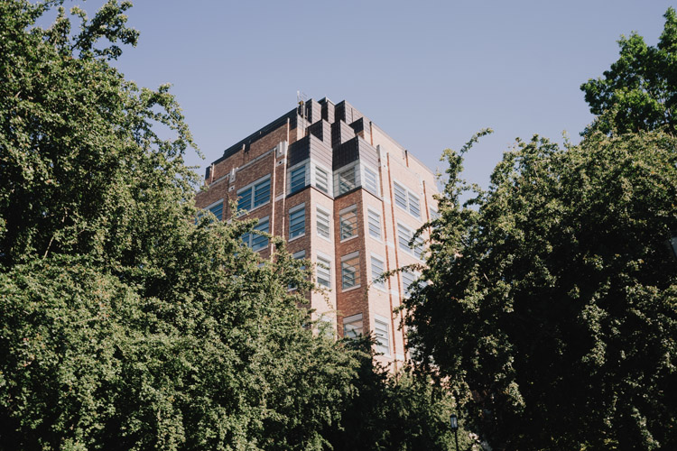
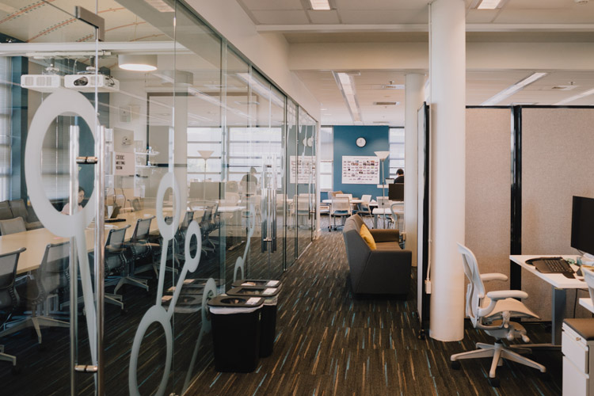
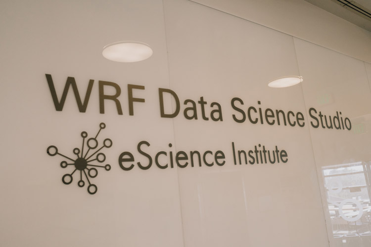

# Event Details

## Schedule
```{Note}
Event schedule will be updated in the months leading up to the event. Up to date 
information is listed at [2025.hackweek.io](https://2025.hackweek.io).  
```

**[WRF Data Science Studio](https://maps.app.goo.gl/cTSuGrxekn5zcSxT9)**

9:00 - 5:00 p.m.

August 18-22, 2025


## Event Venue

UW Physics/Astronomy Tower

6th Floor, 3910 15th Ave NE

Seattle, WA 98195






In a departure from recent hackweek years in larger venues, we're returning to the 
WRF Data Science Studio. For the style of event this year; a smaller gathering of 
invitation only peers, the data studio is a great environment for smaller teams.

```{Note}
More information about first day check-in will be updated here before the event and 
communicated via [ICESAT-2 Slack](https://icesat2hackweek.slack.com/).
```

## Venue Access
* The data studio is open from 9:00 a.m., Monday through Friday.
* There are two elevators from the ground floor. *Please note stairwell access is 
not available when attempting to enter the 6th floor.*

## Lunch
Lunch will be provided at the data studio in addition to tea & coffee. Menu will be 
informed by a survey collecting food preferences. As in previous years, breakfast 
and dinner are not provided.

## Event Request FAQ

**What food is provided during the week?**

UW will provide snacks, tea & coffee, and catered lunch during the event from 
Monday - Friday. Please note that breakfast and meals outside of the event hours 
are not provided. 

**Will my food preferences and restrictions be taken into consideration?**

Yes. Dietary preferences and restrictions are accounted for based on your responses 
in the registration form you’ve already completed.

**What food do you typically serve during lunch?**

The Organizing team ensures a non-repeating lunch menu each day, informed by the 
overall preferences outlined in the registration form you’ve already completed.

**Can I request an accessibility or technology accommodation?** 

UW is committed to providing [access and accommodation](https://www.washington.edu/accessibility/) in its services, 
programs, and activities. To make a request connected to accessibility, an 
accommodation, or health condition contact us at [escience-hackweeks@uw.edu](mailto:escience-hackweeks@uw.edu) 
by August 1st, 2025.

**Will there be a private lactation room at the event venue?**

Yes. A secure private space for lactation purposes will be available. 

**Will there be a private space for spiritual practice at the event venue?**

UW provides spiritual practice spaces for current students, staff, and faculty. 
Access to these spaces cannot be guaranteed at this time for campus visitors, 
however, if we receive enough interest in this request, the Organizing Team 
will explore options for what is feasible within the constraints of our venue 
and nearby resources.

**Can I borrow a laptop for the week?**

UW has a limited about of PC and Mac notebooks available for attendees. If you 
indicated need during the registration process we will reach out with more instructions.

**Can you provide access to childcare services?**

Unfortunately, no. There are no available resources to provide childcare during the 
hackweek event.